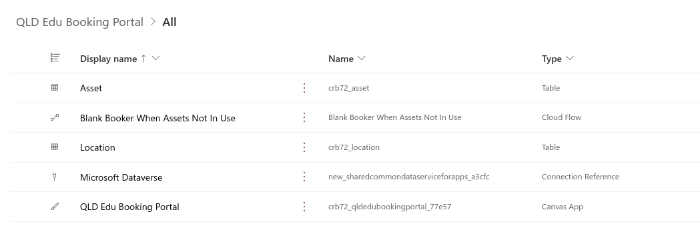
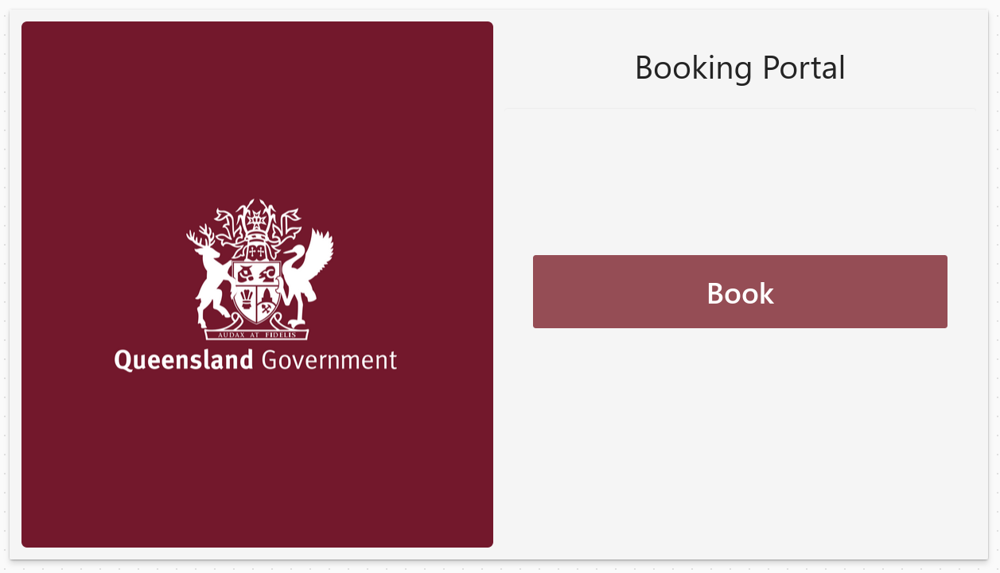
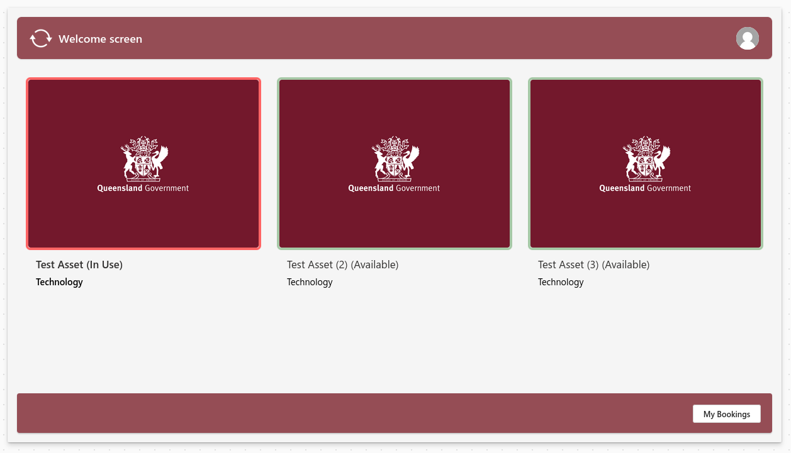
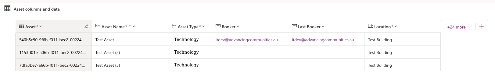
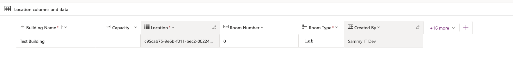
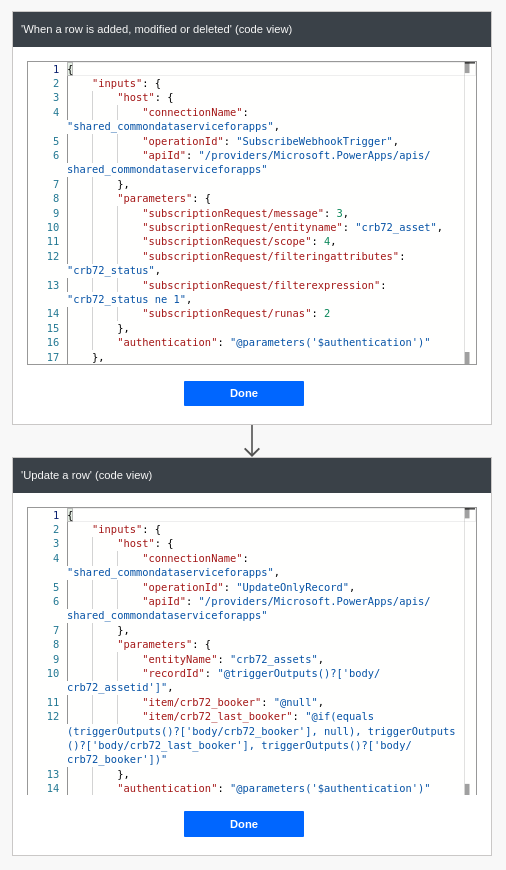

# (Demo) QLD Edu Booking Portal
A Demo developed with a self-administered two day deadline, shows my capacity to independently work with Microsoft Power Apps. Exported with built-in 'Export a solution'.

For educational purposes.

Index of objects in the demo:

## Booking Portal (Canvas)

## Tables
Truncated complexity to focus on an MVP.
### Asset

### Location

## Dataverse
How the app components connect.

## Power Automation
### Blank Booker When Assets Not In Use
1. triggers on Asset table modify
2. for the modified rows, filters for not 'In Use' (status=1)
3. moves the current booker to 'Last Booker' column
4. nullifies the current booker in the 'Booker' column

